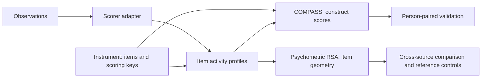

# xpsych: A Python toolbox for explainable psychiatry

[](https://pypi.org/project/xpsych/)
[](https://github.com/linlab/xpsych/actions/workflows/tests.yml)
[](https://github.com/linlab/xpsych/actions/workflows/tests.yml)
[](https://pypi.org/project/xpsych/)
[](LICENSE)

**Psychometric RSA and COMPASS construct scoring, with explicit measurement assumptions.**

xpsych connects observations to psychological constructs through instrument items.
**Psychometric representational similarity analysis (RSA)** compares how different
sources organize the same items. **COMPASS** applies scoring keys to item activities
to produce construct scores. Both use the same item coordinates, so you can examine
what a score captures and which structure comes from the measurement procedure.

The numerical core accepts item profiles from any source. Optional text adapters
produce profiles from embeddings or entailment models. Population geometry and
person-level agreement are tested separately.

**Author:** Baihan Lin. For scientific questions or questions about using xpsych,
contact [doerlbh@gmail.com](mailto:doerlbh@gmail.com).
For reproducible software problems, use [GitHub Issues](https://github.com/linlab/xpsych/issues).

## Install

Python 3.10 or later:

```bash
python -m pip install --pre xpsych
# Optional embedding and entailment models:
python -m pip install --pre 'xpsych[text]'
```

The core requires NumPy and SciPy. Importing xpsych does not load models or download
weights. The current release is `0.1.0a1`; `--pre` selects this alpha release.
For development or paper reproduction, clone the repository and install with
`python -m pip install .`.

## Quick start

```python
import numpy as np
import xpsych as xp

# Real instrument: the public-domain 50-item IPIP Big-Five Factor Markers.
bank = xp.instruments.ipip50()

# Simulated activities for an offline example: 60 observations × 50 items.
# Replace with your profiles, with columns in bank.ids order.
rng = np.random.default_rng(7)
activities = rng.normal(size=(60, len(bank.items)))

scores = xp.compass(activities, bank)       # construct name -> score per observation
rdm = xp.rsa(activities)                    # 50 × 50 item correlation distances
print(scores["extraversion"])

# Compare two sources measured on the same ordered items.
second_source = activities + rng.normal(size=activities.shape)
comparison = xp.rsa(activities, second_source, seed=7)
print(comparison.correlation, comparison.pvalue)
```

IPIP provides the real item wording and scoring directions; the observations above
are explicitly simulated. The [official IPIP items and keys](https://ipip.ori.org/newBigFive5broadKey.htm)
are [public domain](https://ipip.ori.org/). COMPASS applies signed weights to model
activities. This differs from scoring 1–5 questionnaire responses, and does not
produce calibrated personality ratings or diagnostic thresholds.

For actual text, supply a local model explicitly:

```python
import xpsych as xp
from xpsych.text import EmbeddingScorer

bank = xp.instruments.ipip50()
scorer = EmbeddingScorer.from_pretrained("/path/to/local/embedding-model")
scores = xp.compass(
    ["I enjoy meeting new people and often start conversations."],
    bank,
    scorer=scorer,
)
```

Run `python examples/quickstart.py` for the offline example, or
`python examples/ipip_text.py --model /path/to/local/embedding-model` for text scoring.
See [text scoring](docs/text-scoring.md) for the entailment adapter and model setup.

## Compute item activities

An activity matrix has one row per observation and one column per instrument
item. The column order is `bank.ids`.

**From text with a local embedding model:**

```python
import xpsych as xp
from xpsych.text import EmbeddingScorer

bank = xp.instruments.ipip50()
scorer = EmbeddingScorer.from_pretrained("/path/to/local/embedding-model")
texts = [
    "I enjoy meeting new people and often start conversations.",
    "I prefer quiet evenings and tend to listen rather than speak.",
    "I plan my week carefully and finish tasks before starting new ones.",
]
activities = scorer.score(texts, bank)  # cosine similarity, texts × items
scores = xp.compass(activities, bank)
rdm = xp.rsa(activities)
```

For entailment-minus-contradiction activities, use `NLIScorer` with a local NLI
model and explicit item hypotheses. See [text scoring](docs/text-scoring.md).
A small example demonstrates the API, not the sample size needed for inference.

**From embeddings you already have:**

```python
# observation_embeddings: observations × embedding dimensions
# item_embeddings: items × the same embedding dimensions, in bank.ids order
activities = xp.cosine_activities(observation_embeddings, item_embeddings)
```

This normalizes embedding rows and computes their pairwise cosine similarities.
For two-source RSA, each source must have the same ordered item columns.

## Add your own inventory

Supply item IDs, wording and the signed weights for each construct. For example,
you can define the published 10-item IPIP Extraversion scale explicitly:

```python
import xpsych as xp

positive = [
    "Am the life of the party.", "Feel comfortable around people.",
    "Start conversations.", "Talk to a lot of different people at parties.",
    "Don't mind being the center of attention.",
]
negative = [
    "Don't talk a lot.", "Keep in the background.", "Have little to say.",
    "Don't like to draw attention to myself.", "Am quiet around strangers.",
]
wording = positive + negative
items = [
    xp.Item(f"E{i+1}", text, hypothesis="I " + text[0].lower() + text[1:])
    for i, text in enumerate(wording)
]
keys = {"extraversion": {f"E{i+1}": 1 if i < 5 else -1 for i in range(10)}}
bank = xp.ItemBank(items, keys)

# Use the scorer and texts from the example above:
activities = scorer.score(texts, bank)
scores = xp.compass(activities, bank)
```

Replace the wording and keys with your instrument's authorized items. Add more
constructs as additional entries in `keys`; items omitted from a construct get
zero weight. The keys describe signed activity sums, not reverse-coded Likert
responses. This example uses the complete published IPIP Extraversion key,
rather than inventing a new validated scale.

## How it fits together



Scores and RDMs are two read-outs of the same profiles. A correlation RDM does not
retain the activity levels needed to recover a person's construct scores.
See [architecture and UML](docs/architecture.md) for module responsibilities and
[API](docs/api.md) for function signatures.

| Module | Responsibility |
| --- | --- |
| `instruments` | Item definitions, ordered banks, scoring keys and the IPIP-50 bank |
| `scoring` | Item activities, keyed COMPASS scores and aggregation |
| `geometry` | RDMs, cross-source RSA, centring and reference whitening |
| `validation` | Agreement with observed scores, matched by person ID |
| `text` | Optional embedding and entailment adapters |

## Reproduce the paper

**COMPASS 2.0: psychometric representational similarity analysis distinguishes
symptom structure from personal signal.**

The [`papers/compass2/`](papers/compass2/README.md) folder contains the reproduction
recipe, input schemas and aggregate reference results. Exact reproduction uses
Python 3.11 and the pinned dependencies listed there. The wheel contains the reusable
package; the repository and source distribution also include the paper bundle.

## Cite this work

If you use xpsych, psychometric RSA or COMPASS 2.0, please cite:

> Lin, Baihan (2026). *COMPASS 2.0: psychometric representational similarity
> analysis distinguishes symptom structure from personal signal*. [arXiv:2610.06615](https://arxiv.org/abs/2610.06615).

The preprint is available at [arXiv:2610.06615](https://arxiv.org/abs/2610.06615).
See [citation metadata](CITATION.cff).

The package contains no participant transcripts, response records or model weights.
Full reproduction requires authorized source datasets and permitted instrument
inputs. The bundled IPIP-50 is public domain; other instruments retain their own
terms. See [data and instruments](docs/data-and-instruments.md).

## Interpretation

A high RSA correlation can reflect shared item wording rather than personal signal.
Whitening tests departure from a specified reference and depends on that reference's
assumptions. Use person-paired validation when making claims about individuals.
See [concepts](docs/concepts.md).

Code license: [MIT](LICENSE). Dataset and instrument terms are separate.
