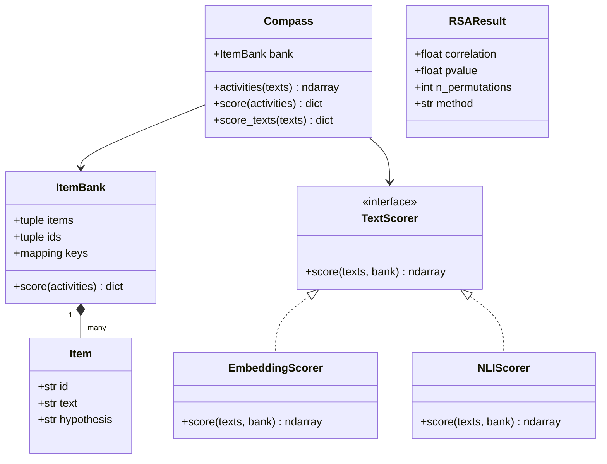

# Architecture

## The shared representation

The central object is an **observations × items activity matrix**. An observation
may be a text segment, an interview, or a person-mean profile. Item columns have a
fixed order supplied by an `ItemBank`. Sources can have different numbers of rows,
but RSA requires identical item coordinates. Person-level comparisons additionally
require matching person identifiers.

There are two independent read-outs:

- **COMPASS:** multiply activity profiles by construct keys to obtain scores.
- **Psychometric RSA:** summarize relations among items, then compare those
  geometries across sources and against declared references.

A correlation RDM discards levels and scale. It cannot uniquely reconstruct a
person's scores. Keeping both read-outs connected to the original profiles makes
this distinction explicit.

## UML: implemented interfaces

`TextScorer` denotes the existing structural interface: an object with the stated
`score` method. No base class or inheritance is required. Numerical geometry is
implemented as functions, rather than an extra hierarchy of stateful objects.
`geometry.compare` and two-input `xp.rsa` return `RSAResult`.

## Modules and dependencies

| Module | Owns | Depends on |
| --- | --- | --- |
| `instruments.py` | Items, ordered banks, scoring keys, IPIP-50 loader | NumPy, input validation |
| `scoring.py` | Cosine/stance activities, keyed scoring, person aggregation, `Compass` | Instruments, NumPy |
| `geometry.py` | Covariance, RDMs, reference whitening, centring, permutation comparisons | NumPy, SciPy, numerical kernels |
| `validation.py` | Person-ID alignment and paired correlation inference | NumPy, input validation |
| `text.py` | Local embedding and entailment adapters | Scoring; optional model libraries |
| `_api.py` | `xp.compass(...)` and `xp.rsa(...)` convenience functions | Scoring, geometry |
| `_geometry.py` | Stable numerical kernels used by public geometry and reproduction | NumPy |
| `_validation.py` | Shared array, label and scalar checks | NumPy |

The low-level kernels retain fixed estimator and permutation behavior required by
the COMPASS 2.0 reference outputs. Experimental deconvolution routines live there
but are not exposed as supported top-level methods. New applications use the public
functions, which validate inputs and explain assumptions.

`papers/compass2/codes/geometry.py` is a thin adapter to those kernels. Paper
scripts also call `scoring` for precision-preserving projections, signed reductions
and hypothesis pooling, and `text` for NLI pair scoring. Segmentation,
analysis plans, corpus loading, specialized resampling and figure recipes stay in
that paper's folder. The reusable package does not import any paper module.

## Functional scope

**Available now:** define instruments and keys; obtain text activities or provide
precomputed profiles; aggregate observations by person; compute construct scores;
compare item RDMs; control wording/reference structure; test person-paired agreement;
and reproduce the COMPASS 2.0 numerical analyses.
